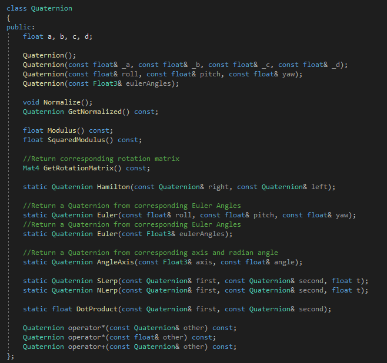
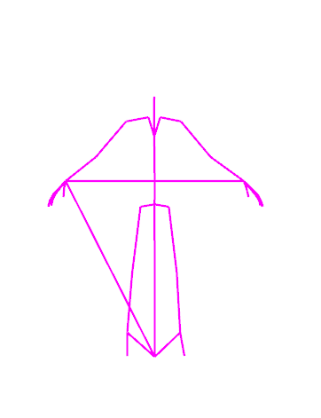
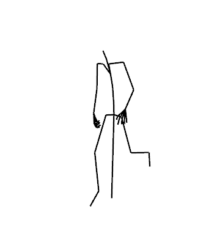
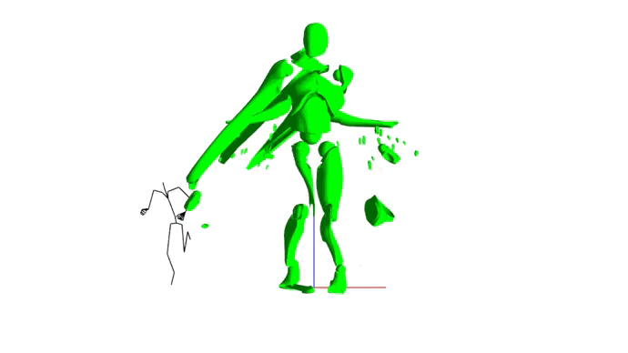
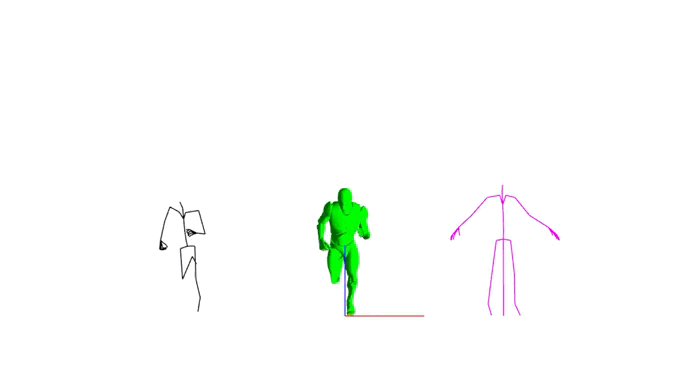

# Animation Programming

*This project is a isart digital's school project.
The goal is to learn the basics of the animation programming.*

Our team : [Nino Masseteau](https://github.com/Elmea) [Camille Gauthier](https://github.com/Lagaffe91)

## First steps
---

First, we needed to create our quaternions in ou maths library

In parallel, we started to read and draw the skeleton of the model in the bind pose.

For the moment, there was zero difficulties to implement thoses features. But it's just the begining...

## Difficulties are comming
---

The next step is now to read, draw and switch between all the animation keyframes ! Thus, while fixing the last bugs on the quaternions interpolations and implementing mesh skinning (more on that later).
So our the first thing we've done was focusing on reading (and drawing) a single keyframe of animation ! Painfull, but it quickly work as we want !

It was just a matter of time before we were able to switch between all animation keyframes for a first glampse at the finish product !

And right after that, we managed to implement transform interpolation to smooth the animation and fully begin the implementation of mesh skinning.
In this gif, we've slowed down the animation to show the effect of interpolation. Left skeleton is basic keyframe switch, whereas the right one is using nlerp to smooth the animation.

Now ! With all of this skeleton mess finally finished , it's skinning time !
As you already see, that wasn't the easiest part of the project. The mesh was often broken in the prefious gif's...

So to debug this mess, we searched in the skinning shader, and then in our matrix what caused this bug.

And as we found out the problem was caused by the order of the matrix, in fact, the engine was considerating
our matrix like collumn majors ones, but they are row majors.

So we needed to adapt ou matrices's product to get the expected result.

## Some cutted feature
---

- We tried to implement IMGUI on the custom render engine, but we didn't manage to have a result that was satisfying us.

- Animation blending, due to the short time we had to implement it.

- Code architecture is not optimal, a huge code refactor was made, but it broke some features we could not fix with the time left.
